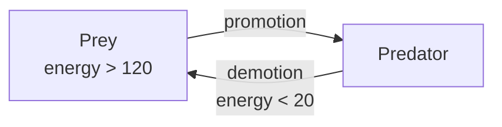

## Overview

A multi-species ecosystem where prey flock, forage, and reproduce while predators hunt. Population balance emerges naturally through energy dynamics and bidirectional mutation.

## Emergent Behaviors

- **Flocking** — Prey self-organize into groups via local rules
- **Trail formation** — Pheromone highways emerge between food sources
- **Population oscillation** — Predator-prey cycles (Lotka-Volterra dynamics)
- **Fitness-based mutation** — Strongest prey become predators; weak predators demote back
- **Stochastic death** — Random environmental noise prevents static equilibria

## Key Mechanics

### Energy Flow
- Prey gain energy passively (grazing) and near food sources
- Predators gain energy only by killing prey
- All agents lose energy over time
- Reproduction occurs at energy threshold

### Bidirectional Mutation


The strongest prey mutate into predators when predator count drops below 3. Weak predators that can't find food demote back to prey. This creates a self-correcting feedback loop.

### Kill Ring
Predators have a kill radius of 8 units. Any prey entering this zone is neutralized. Cooldown of 180 ticks prevents rapid kills.

## Parameters

| Parameter | Value | Effect |
|-----------|-------|--------|
| Prey count | 1000 | Initial population |
| Predator count | 10 | Initial hunters |
| Kill cooldown | 180 ticks | ~3s between kills |
| Reproduce threshold | 180 (prey) | Energy to spawn offspring |
| Random death | 0.03%/tick | Environmental noise |
| Population cap | 3000 | Prevents runaway growth |

## Mathematical Foundation

Population dynamics follow a modified Lotka-Volterra system with stochastic perturbation:

```
P(t+1) = P(t) + births - kills - random_deaths
Q(t+1) = Q(t) + promotions - demotions - starvation
```

See the [full theory document](/theory/) for proofs of stability and boundedness.
