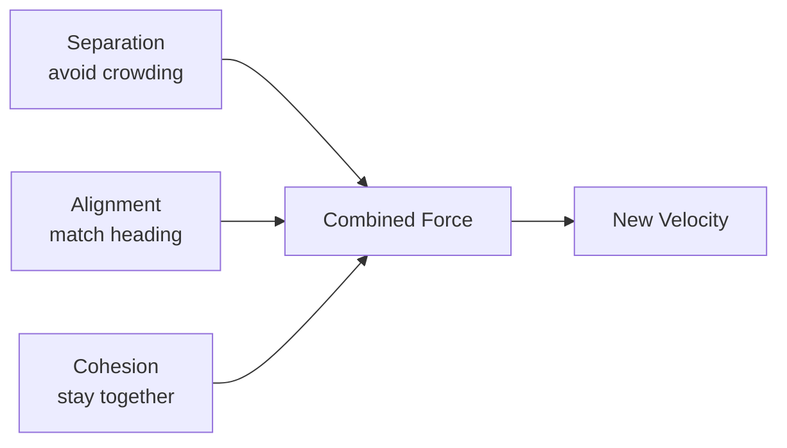

## Overview

1000+ agents self-organize into coherent flocks using only three local rules — no leader, no global coordination. Inspired by Craig Reynolds' Boids (1987).

## The Three Rules

1. **Separation** — Steer away from neighbors that are too close
2. **Alignment** — Match the average heading of nearby agents
3. **Cohesion** — Steer toward the center of mass of neighbors

## Why It Matters

This demonstrates that **complex global patterns emerge from simple local rules**. No agent knows the shape of the flock. No agent is in charge. The pattern is an emergent property of the system — not designed, but grown.

## Parameters

| Parameter | Default | Effect |
|-----------|---------|--------|
| Separation weight | 1.5 | How strongly agents avoid crowding |
| Alignment weight | 1.0 | How strongly agents match neighbors |
| Cohesion weight | 1.0 | How strongly agents stay grouped |
| Perception radius | 50 | How far agents can sense |
| Max speed | 2.0 | Movement speed cap |

All parameters are adjustable in real-time via the control panel.
