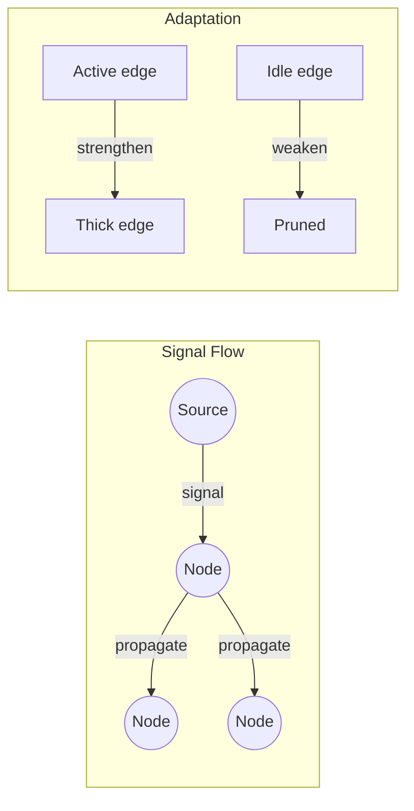

## Overview

A network of stationary nodes connected by weighted edges. Signals propagate along edges, strengthening active connections and pruning idle ones. The network self-organizes its topology to efficiently route information — like the "Wood Wide Web" of fungal networks beneath forests.

## How It Works

1. **Nodes** are stationary points in space (like fungal junctions)
2. **Edges** connect nearby nodes with variable strength
3. **Signals** travel along edges at a fixed speed, decaying as they go
4. **Active edges strengthen** — Hebbian learning ("fire together, wire together")
5. **Idle edges weaken** and eventually disconnect
6. **Highly activated nodes grow new edges** toward nearby unconnected nodes

## Biological Analogue

Underground fungal networks (mycelium):
- Connect trees across entire forests
- Share nutrients and chemical warning signals
- Strengthen connections that carry more traffic
- Prune connections that aren't used
- Grow toward nutrient sources

Scientists call this the "Wood Wide Web" — a distributed, adaptive communication infrastructure with no central controller.

## Network Properties

| Property | Mechanism |
|----------|-----------|
| Self-organization | Edges adapt based on usage |
| Fault tolerance | Pruned edges regrow if needed |
| Efficiency | Network converges toward Steiner tree |
| Scalability | Local rules, no global coordination |

## Parameters

| Parameter | Default | Effect |
|-----------|---------|--------|
| Signal speed | 0.02 | How fast signals traverse edges |
| Signal decay | 0.005 | Signal loss during propagation |
| Strengthen rate | 0.01 | How fast active edges grow |
| Weaken rate | 0.002 | How fast idle edges decay |
| Growth threshold | 0.3 | Activation needed to sprout new edge |
| Max edges/node | 6 | Connectivity limit |
