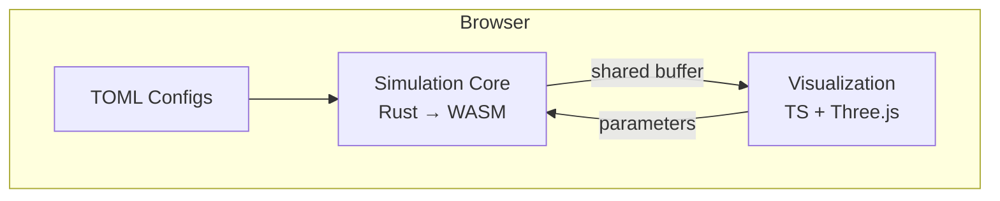
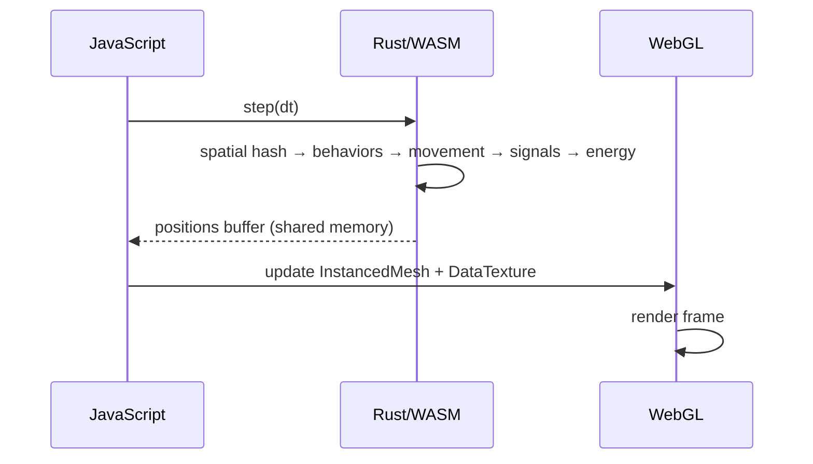
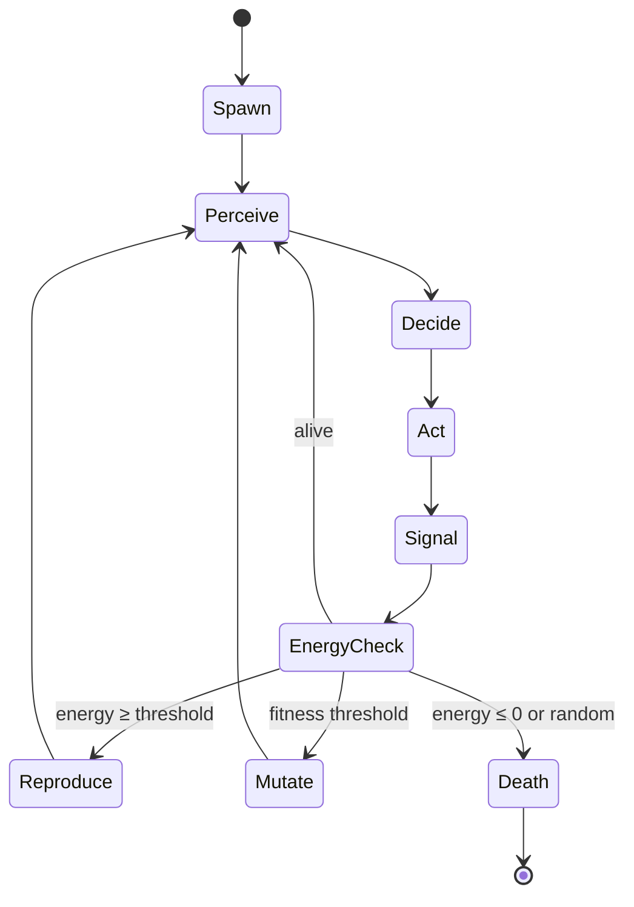

## Architecture

Kernel runs entirely in the browser. The simulation core is written in Rust and compiled to WebAssembly for high performance. The visualization layer uses Three.js for real-time rendering.



## Per-Frame Data Flow



## Key Systems

| System | Role |
|--------|------|
| **Spatial Hash** | O(1) neighbor queries for agent interaction |
| **Boids Engine** | Flocking via separation, alignment, cohesion |
| **Signal Grid** | Pheromone deposition, diffusion, evaporation |
| **Energy System** | Birth, death, mutation based on energy flow |
| **Forager AI** | 3-sensor chemotaxis (Physarum-inspired) |
| **Kill Ring** | Predator hunting with cooldown mechanics |

## Agent Lifecycle



## Config-Driven Experiments

New experiments are defined as TOML files — no code changes needed:

```toml
[experiment]
name = "Multi-Species Ecosystem"

[[species]]
name = "prey"
count = 1000
behavior = "boids+forager"
max_speed = 2.0

[[species]]
name = "predator"
count = 10
behavior = "predator"
max_speed = 2.8
```
