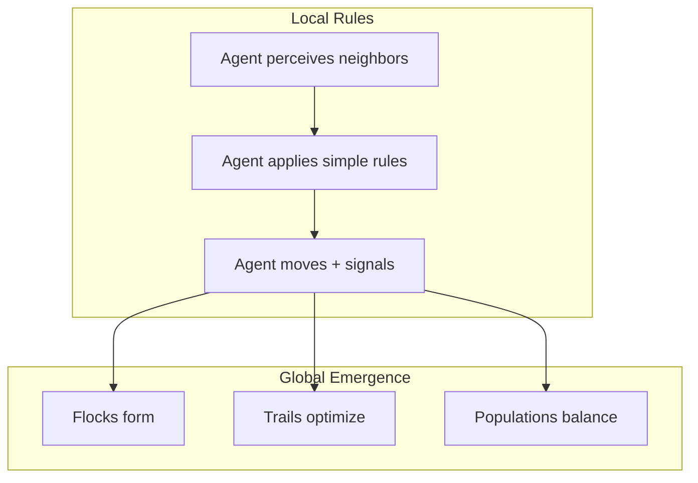

## The Problem

Modern AI systems are centralized, static, text-oriented, and disconnected from real-world coordination problems.

Nature solved coordination differently millions of years ago:
- Ant colonies optimize routes without centralized control
- Birds flock through local coordination alone
- Fungi communicate through mycelial networks spanning entire forests
- Biological systems adapt continuously to uncertainty

## What We're Building

Kernel is a **software-first intelligence layer for autonomous systems**.

Not chatbots. Not static automation. But systems that can:
- Perceive their environment
- Coordinate collectively
- Adapt to disruption
- Communicate through signals
- Evolve behavior over time

## How It Works

Each agent follows simple local rules. No agent knows the global pattern. Intelligence emerges from the collective — just like in nature.

## Long-Term Direction

Kernel could evolve into:
- Autonomy infrastructure for robotics
- Swarm coordination systems
- Distributed machine ecosystems
- Intelligent simulation platforms
- Adaptive infrastructure intelligence

## Philosophy

> Kernel explores what intelligent systems look like when inspired less by traditional software architecture and more by nature itself.

Not rigid. Not centralized. Not static.

**Adaptive. Distributed. Emergent. Alive.**
